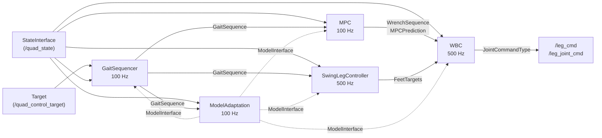

# Control Pipeline Stage Contracts

**Status:** frozen as of M1.1 (issue #1); host→concrete casts removed in M1.2 (issue #2) ·
**Applies to:** `ws/src/controllers`

This document is the reference contract for the five control-pipeline stages that
`mit_controller_node` hosts. It records, for each stage, the methods an implementation **must**
provide, the data that flows in and out, the rate the host calls it at, and what the host assumes
about threading and locking.

## 1. Purpose and how to use this document

The controllers package is being refactored from a monolithic node into a pluginlib-based pipeline
host (meta issue #24). Loading a stage as a plugin is only possible if the host talks to it purely
through an abstract interface. When M1.1 froze these contracts the host reached through the
interfaces into concrete algorithm classes in 18 places; M1.2 (issue #2) removed all of them for
stage access via the `SetParameter` hook (§6), leaving only the follow-up items still owned by #9
and #13 (§5). This document freezes what the contracts are, states where the host still deviates,
and records the API changes made.

Rules going forward:

- **Changing a pure-virtual signature in any of the five headers requires updating this file in the
  same pull request.** The method tables in §4 are the specification; the headers are the
  implementation of that specification.
- New stage implementations are written against §4, not against an existing concrete class.
- Anything listed in §5 is a known deviation with an owning issue. Do not add new ones.

## 2. The five stages

| Stage | Interface header | Concrete implementations |
|---|---|---|
| Gait sequencing | `mit_controller/gait_sequencer_interface.hpp` | `SimpleGaitSequencer`, `AdaptiveGaitSequencer`, `BioGaitSequencer` |
| Force optimisation | `mit_controller/mpc_interface.hpp` | `MPC` (acados QP) |
| Swing trajectories | `mit_controller/swing_leg_controller_interface.hpp` | `SwingLegController` |
| Whole-body control | `mit_controller/wbc_interface.hpp` | `WBCArcOPT` (Go2), `InverseDynamics` (ULab) |
| Model adaptation | `model_adaptation/model_adaptation_interface.hpp` | `KFModelAdaptation`, `LeastSquaresModelAdaptation` |



Solid arrows are per-cycle data flow. The dashed arrow is the model-update broadcast, which is
event-driven rather than periodic (§4.5).

## 3. Timing and threading

All periods are `static constexpr` in `mit_controller/mit_controller_params.hpp`. `main()` runs a
`rclcpp::executors::MultiThreadedExecutor` with **4 threads**; each loop below owns a **mutually
exclusive callback group**, so a given stage is never re-entered concurrently, but different stages
do run concurrently on different threads.

| Loop | Callback | Constant | Period | Rate | Callback group | Mutex held around stage calls |
|---|---|---|---|---|---|---|
| MPC | `MPCLoopCallback` | `MPC_CONTROL_DT` | 10 ms | 100 Hz | `mpc_call_back_group_` | `mpc_lock_` + `gait_sequencer_lock_` |
| Swing leg | `SLCLoopCallback` | `SWING_LEG_DT` | 2 ms | 500 Hz | `slc_callback_group_` | `slc_lock_` |
| Control / WBC | `ControlLoopCallback` | `CONTROL_DT` | 2 ms | 500 Hz | `control_loop_call_back_group_` | `wbc_lock_` |
| Model adaptation | `ModelAdaptationCallback` | `MODEL_ADAPTATION_DT` | 10 ms | 100 Hz | `model_adaptation_callback_group_` | none — see G6 |
| Heartbeat | `HartbeatCallback` | — | 500 ms | 2 Hz | default | none |

Other shared constants a stage implementation may rely on: `N_LEGS = 4`,
`N_JOINTS_PER_LEG = 3`, `GAIT_SEQUENCE_SIZE = 100`, `MPC_PREDICTION_HORIZON = 10`,
`MPC_DT = 50 ms`. The gait sequence therefore spans 100 × 50 ms = 5 s of plan, and the MPC horizon
covers 10 × 50 ms = 500 ms.

### Start-up ordering

Only the MPC and model-adaptation timers are created in the constructor. The **SLC and control-loop
timers are created lazily inside the first `MPCLoopCallback`**
(`mit_controller_node.cpp:866-880`). Consequences for any implementation:

1. `SwingLegControllerInterface` and `WBCInterface` are never called before the gait sequencer and
   MPC have each produced one output. They may assume a valid `GaitSequence` /
   `WrenchSequence` exists on the first call.
2. `GaitSequencerInterface` and `MPCInterface` **are** called before any state has been received;
   they must tolerate a default-constructed `QuadState` on their first cycles.
3. Constructors receive `std::unique_ptr<ModelInterface>` and `std::unique_ptr<StateInterface>`
   clones and take ownership of them. Every stage therefore needs a working destructor — see G4.

### General call-order rule

Within one cycle the host always calls every relevant `Update*` method **before** the `Get*` method.
An implementation may cache in `Update*` and compute in `Get*`, or compute eagerly; the contract
only guarantees the ordering. No `Get*` method may assume it is called exactly once per `Update*`
(§4.1 and §4.3 both have `Get*` methods invoked an extra time for diagnostics).

## 4. Stage contracts

### 4.1 `GaitSequencerInterface`

Header: `ws/src/controllers/include/mit_controller/gait_sequencer_interface.hpp`

| Method | Dir | Called from | Rate |
|---|---|---|---|
| `void UpdateTarget(const Target&)` | in | `MITController` ctor (`:555`), `MPCLoopCallback` (`:813`) | 100 Hz |
| `void UpdateState(const StateInterface&)` | in | `MPCLoopCallback` (`:814`) | 100 Hz |
| `void UpdateModel(const ModelInterface&)` | in | `ModelAdaptationCallback` (`:1014`) | event-driven |
| `void GetGaitSequence(GaitSequence&)` | out | `MPCLoopCallback` (`:817`) | 100 Hz |
| `void GetGaitState(interfaces::msg::GaitState&)` | out | `MPCLoopCallback` (`:959`), diagnostics only | 100 Hz |
| `GS_Type GetType() const` | out | — (currently unused by the host) | — |
| `bool SetParameter(const std::string&, const rclcpp::ParameterValue&)` | in | parameter-event callback, under `gait_sequencer_lock_` | on `ros2 param set` |

**Data.** In: `Target` (`mit_controller/target.hpp`) — world/hybrid-frame pose and twist setpoints,
each with an `active` flag. Out: `GaitSequence` (`mit_controller/gait_sequence.hpp`) — a
`GAIT_SEQUENCE_SIZE`-long plan holding `contact_sequence`, `foot_position_sequence`,
`reference_trajectory_*`, `swing_time_sequence`, and `sequence_mode ∈ {KEEP, MOVE}`.
`GS_Type` is `{SIMPLE, ADAPTIVE, BIOINSPIRED}` (`gait_sequencer_types.hpp`).

**Call order.** `UpdateTarget` → `UpdateState` → `GetGaitSequence`. `GetGaitState` is called later in
the same callback for publishing.

**Threading.** `gait_sequencer_lock_` is held across `:813-817`. It is *not* held for the
`GetGaitState` call at `:959` (G10) nor for the `UpdateModel` call at `:1014`, which runs under
`mpc_lock_` instead (G6). Implementations must be safe against `GetGaitSequence` blocking the 100 Hz
loop; no internal blocking beyond the loop period.

**Notes.** `sequence_mode` transitions drive the MPC weight switch, which as of issue #2 lives
inside `MPC::UpdateGaitSequence` rather than the host (see G1). The `GetGaitState` output is
diagnostic (`/gait_state`), gated on `PUBLISH_GAIT_STATE`. `SetParameter` handles the
`adaptive_gait_sequencer.gait.*` keys for `AdaptiveGaitSequencer`; other sequencers return `false`
and the host reloads the sequencer from scratch (the previous fallback).

### 4.2 `MPCInterface`

Header: `ws/src/controllers/include/mit_controller/mpc_interface.hpp`

| Method | Dir | Called from | Rate |
|---|---|---|---|
| `void UpdateState(const StateInterface&)` | in | `MPCLoopCallback` (`:815`) | 100 Hz |
| `void UpdateModel(const ModelInterface&)` | in | `ModelAdaptationCallback` (`:1013`) | event-driven |
| `void UpdateGaitSequence(const GaitSequence&)` | in | `MPCLoopCallback` (`:818`) | 100 Hz |
| `void GetWrenchSequence(WrenchSequence&, MPCPrediction&, SolverInformation&)` | out | `MPCLoopCallback` (`:844`) | 100 Hz |
| `bool SetParameter(const std::string&, const rclcpp::ParameterValue&)` | in | parameter-event callback, under `mpc_lock_` | on `ros2 param set` |

**Data.** Out: `WrenchSequence` — `MPC_PREDICTION_HORIZON × N_LEGS` ground-reaction forces;
`MPCPrediction` — predicted pose/twist over `MPC_PREDICTION_HORIZON + 1` knots plus the raw 13-state
vector; `SolverInformation` (defined in the same header) — `success`, `return_code`,
`total_solver_time` and acados/QP diagnostics.

**Call order.** `UpdateState` and `UpdateGaitSequence` → `GetWrenchSequence`. `UpdateGaitSequence`
also applies the `KEEP`↔`MOVE` cost-weight switch internally, driven by the sequence's
`sequence_mode` (moved out of the host in issue #2, G1).

**Threading.** `mpc_lock_` held for the whole sequence. **`GetWrenchSequence` is permitted to
block** — the host annotates the call `// This one might block` and warns when
`total_solver_time >= MPC_CONTROL_DT`. It must still return; there is no timeout or cancellation in
the contract. `success == false` is reported by the host as an error but the pipeline continues
using whatever was written into `wrench_sequence`, so an implementation must always leave both
output arguments in a usable state.

**Runtime tuning.** As of issue #2, the host pushes `mpc_state_weights_stand`, `mpc_state_weights_move`,
`mpc_alpha`, `mpc_fmax` and `mpc_mu` through `SetParameter`, which dispatches to the concrete
`SetStateWeights` / `SetInputWeights` / `SetFmax` / `SetMu` internally. The host no longer casts to
`MPC` (was G1; see §6).

### 4.3 `SwingLegControllerInterface`

Header: `ws/src/controllers/include/mit_controller/swing_leg_controller_interface.hpp`

| Method | Dir | Called from | Rate |
|---|---|---|---|
| `void UpdateGaitSequence(const GaitSequence&)` | in | `SLCLoopCallback` (`:1350`), only when `gs_updated_` | ≤ 100 Hz |
| `void UpdateState(const StateInterface&)` | in | `MPCLoopCallback` (`:816`) and `SLCLoopCallback` (`:1359`) | 100 + 500 Hz |
| `void UpdateModel(const ModelInterface&)` | in | `ModelAdaptationCallback` (`:1022`) | event-driven |
| `void GetFeetTargets(FeetTargets&)` | out | `SLCLoopCallback` (`:1360`) | 500 Hz |
| `void GetProgress(std::array<double, N_LEGS>&, std::array<LegState, N_LEGS>&)` | out | `SLCLoopCallback` (`:1361`) | 500 Hz |
| `void GetCurrentTrajs(std::array<Eigen::Vector3d, N_LEGS>&, std::array<Eigen::Vector3d, N_LEGS>&)` | out | `ControlLoopCallback` (`:1301`), diagnostics only | 500 Hz |
| `bool SetParameter(const std::string&, const rclcpp::ParameterValue&)` | in | parameter-event callback, under `slc_lock_` | on `ros2 param set` |

**Data.** Out: `FeetTargets` (`mit_controller/feet_targets.hpp`) — per-leg position, velocity and
acceleration. `LegState` is declared on the interface itself:
`STANCE`, `NOT_STARTED` (scheduled to swing, not yet moving), `SWINGING`, `REACHED`.
`GetCurrentTrajs` returns swing start/end points for the `/swing_leg_trajs` visualisation, gated on
`PUBLISH_SWING_LEG_TRAJECTORIES` (currently `false`).

**Call order.** `UpdateGaitSequence` (conditional) → `UpdateState` → `GetFeetTargets` →
`GetProgress`.

**Threading.** `slc_lock_` is held across `:1345-1368`. Note that `UpdateState` is *also* called
from the 100 Hz MPC loop at `:816` — under `mpc_lock_`, **not** `slc_lock_` (G6) — and
`GetCurrentTrajs` is called from the control loop with no SLC lock at all (G10). An implementation
must not assume single-threaded access today, even though the contract intends it.

**Runtime tuning.** As of issue #2, `slc_swing_height`, `slc_world_blend` and
`maximum_swing_leg_progress_to_update_target` are applied through `SetParameter`, which dispatches to
`SetSwingHeight` / `SetWorldBlend` / `SetMaximumSwingProgressToUpdateTarget` internally. The host no
longer casts to `SwingLegController` (was G2).

### 4.4 `WBCInterface<JointCommandType>`

Header: `ws/src/controllers/include/mit_controller/wbc_interface.hpp`

| Method | Dir | Called from | Rate |
|---|---|---|---|
| `void UpdateState(const StateInterface&)` | in | `ControlLoopCallback` (`:1069`) | 500 Hz |
| `void UpdateModel(const ModelInterface&)` | in | `ModelAdaptationCallback` (`:1018`) | event-driven |
| `void UpdateTarget(const Quaterniond&, const Vector3d& pos, const Vector3d& lin_vel, const Vector3d& ang_vel)` | in | `ControlLoopCallback` (`:1075`) | 500 Hz |
| `void UpdateFeetTarget(const FeetTargets&)` | in | `ControlLoopCallback` (`:1246`) | 500 Hz |
| `void UpdateFootContact(const FootContact&)` | in | `ControlLoopCallback` (`:1247`) | 500 Hz |
| `void UpdateWrenches(const Wrenches&)` | in | `ControlLoopCallback` (`:1248`) | 500 Hz |
| `WBCReturn GetJointCommand(JointCommandType&)` | out | `ControlLoopCallback` | 500 Hz |
| `bool SetParameter(const std::string&, const rclcpp::ParameterValue&)` | in | parameter-event callback, under `wbc_lock_` | on `ros2 param set` |

**Type members.** `JOINT_COMMAND_TYPE`, `Wrenches = std::array<Eigen::Vector3d, N_LEGS>`,
`FootContact = std::array<bool, N_LEGS>`. `WBCReturn` (same header) carries `success`,
`qp_update_time`, `qp_solve_time`.

**Command types** (`mit_controller/joint_commands.hpp`): `CartesianCommands` (per-leg position,
velocity, force → `/leg_cmd`) or `JointTorqueVelocityPositionCommands` (per-joint → `/leg_joint_cmd`).
Which one is used is fixed **at compile time** by `USE_WBC`, itself set from `ROBOT_MODEL`
(`GO2` → `WBCArcOPT` with joint commands, `ULAB` → `InverseDynamics` with Cartesian commands).

**Call order.** `UpdateState` → `UpdateTarget` → `UpdateFeetTarget` → `UpdateFootContact` →
`UpdateWrenches` → `GetJointCommand`. All six inputs are refreshed every cycle before the solve.

**Important:** the target passed to `UpdateTarget` is **`mpc_prediction.orientation[1]` /
`position[1]`** — the MPC's prediction one step ahead — not the raw gait-sequence target. The
commented-out alternative at `:1070` shows the gait-sequence variant that is *not* in use.

**Threading.** `wbc_lock_` is held from `:1064` to `:1279`, i.e. across the contact FSM, all
`Update*` calls and the solve. Unlike the MPC, the host does **not** warn when the WBC overruns its
2 ms budget — the check exists but is commented out at `:1292-1297`.

**Runtime tuning.** As of issue #2, the `wbc.inverse_dynamics.*` keys are applied through
`SetParameter`. `InverseDynamics` dispatches them to `setFootPositionBasedOnTargetHeight`,
`setFootPositionBasedOnTargetOrientation`, `setTransformationFilterSize` (now the correct setter —
was G7) and `setTargetVelocityBlend`; `WBCArcOPT` has no runtime keys and returns `false` (the host
then logs the key as unsupported). The host no longer casts to `InverseDynamics` (was G3, G5). The
template parameter itself remains a plugin blocker — see G8 (issue #13). The host's
compile-time-fixed `GetJointCommand` dispatch no longer `reinterpret_cast`s between `WBCInterface`
instantiations (was part of G8; the residual UB path is now a logged error).

### 4.5 `ModelAdaptationInterface`

Header: `ws/src/controllers/include/model_adaptation/model_adaptation_interface.hpp`

| Method | Dir | Called from | Rate |
|---|---|---|---|
| `void UpdateState(const StateInterface&)` | in | `ModelAdaptationCallback` (`:993`) | 100 Hz |
| `void UpdateGaitSequence(const GaitSequence&)` | in | `ModelAdaptationCallback` (`:997`) | 100 Hz |
| `bool DoModelAdaptation(ModelInterface&)` | in/out | `ModelAdaptationCallback` (`:998`) | 100 Hz |
| `Eigen::Vector<double, NUM_PARAMS> GetParameterVector() const` | out | diagnostics (`:1000`) | 100 Hz |
| `Eigen::Matrix<double, NUM_PARAMS, NUM_PARAMS> GetParameterCovariance() const` | out | diagnostics (`:1002`) | 100 Hz |
| `Eigen::Vector<double, NUM_PARAMS> GetDelta() const` | out | diagnostics (`:1004`) | 100 Hz |
| `Eigen::Vector<double, 6> GetTotalForceTorque() const` | out | diagnostics (`:1005`) | 100 Hz |
| `Eigen::Vector<double, NUM_PARAMS> GetSV() const` | out | diagnostics (`:1007`) | 100 Hz |
| `bool SetParameter(const std::string&, const rclcpp::ParameterValue&)` | in | parameter-event callback | on `ros2 param set` |

`NUM_PARAMS = 3` (mass, CoM offset terms). The whole stage is gated on the `use_model_adaptation`
parameter; when it is false none of these are called.

**`DoModelAdaptation` is the only mutating stage method in the pipeline.** It takes the host's
`QuadModelPino` by non-const reference and returns `true` if it changed it. On `true`, the host
broadcasts the new model to every other stage — `mpc_`, `gs_`, `wbc_`, `slc_` — and publishes it on
`/quad_model` (`:1009-1032`). This is the model-update fan-out that issue #15 (M3.4) will factor
into a helper.

**Call order.** `UpdateState` → `UpdateGaitSequence` → `DoModelAdaptation` → the five `Get*`
accessors (called unconditionally, for `/quad_model_debug`, whether or not the model changed).

**Threading.** This stage runs in its own callback group with **no mutex protecting the model it
mutates** — see G6. The `Get*` accessors are `const` and must be side-effect free.

## 5. Gaps between the contracts and the current host

Every item below is a place where `mit_controller_node` does not respect the contract above, or
where the contract is incomplete. Each has an owning follow-up issue.

| # | Gap | Evidence | Impact | Owner |
|---|---|---|---|---|
| G1 | MPC tuning setters not on `MPCInterface` | was `reinterpret_cast<MPC*>` at `mit_controller_node.cpp:367, 376, 382, 387, 392, 824, 831`; methods at `mpc.hpp:145-148` | Blocked plugin loading. `:824`/`:831` were on the **hot 100 Hz path** (weight switch on `KEEP`↔`MOVE`). **Fixed in M1.2:** setters dispatched via `MPCInterface::SetParameter`; the weight switch moved into `MPC::UpdateGaitSequence` | #2 — **fixed** |
| G2 | SLC tuning setters not on the interface | was `reinterpret_cast<SwingLegController*>` at `:458, 462, 471` | Blocked plugin loading. **Fixed in M1.2:** dispatched via `SwingLegControllerInterface::SetParameter` | #2 — **fixed** |
| G3 | WBC tuning setters not on the interface | was `reinterpret_cast<InverseDynamics*>` at `:440, 446, 452, 466` | Blocked plugin loading; `InverseDynamics`-specific. **Fixed in M1.2:** dispatched via `WBCInterface::SetParameter`; `WBCArcOPT` returns `false` | #2 — **fixed** |
| G4 | Missing virtual destructors | `SwingLegControllerInterface`, `WBCInterface<T>`, `ModelAdaptationInterface` had none, yet the host owns all three as `std::unique_ptr<Interface>` (`mit_controller_node.hpp:111-117`) | Deleting through the base pointer was undefined behaviour and leaked the `unique_ptr<ModelInterface>` / `unique_ptr<StateInterface>` each implementation owns | **fixed in M1.1** |
| G5 | `typeid` guards are dead code | was `:439, 445, 451` comparing `typeid(wbc_.get())` — a *pointer* type — with `typeid(InverseDynamics)` | Never equal, so the three `wbc.inverse_dynamics.*` parameters silently did nothing. **Fixed in M1.2:** dead guards removed; keys routed to `WBCInterface::SetParameter` | #2 — **fixed** |
| G6 | Inconsistent lock discipline | `ModelAdaptationCallback` mutates `quad_model_` unlocked (`:998`); `gs_->UpdateModel` (`:1014`) and `slc_->UpdateState` (`:816`) run under `mpc_lock_` rather than their own stage lock | The contract cannot state "one mutex per stage" until this is regularised. Model ownership is undefined | #9 |
| G7 | Wrong setter called | was `:466-468` — parameter `wbc.inverse_dynamics.transformation_filter_size` called `setFootPositionBasedOnTargetOrientation(integer_value)` instead of `setTransformationFilterSize` | Pre-existing bug; the filter size could not be changed at runtime and a bool setter received an int. **Fixed in M1.2:** `InverseDynamics::SetParameter` calls the correct setter | #2 — **fixed** |
| G8 | `WBCInterface` is a template | `WBCType` is a `std::conditional<USE_WBC, …>` typedef (`mit_controller_node.hpp:112-114`); `reinterpret_cast` was at `:604, 623, 1257, 1269` | A class template cannot be a pluginlib base class; the command type must become a runtime choice. **Partially addressed in M1.2:** all four `reinterpret_cast`s removed (construction and `GetJointCommand` dispatch now use `if constexpr` in templated contexts; a mismatched `leg_control_mode_` is a logged error instead of UB). De-templating the interface itself remains **#13** | #13 |
| G9 | `AdaptiveGaitSequencer` config escape hatch | was `dynamic_cast` + `ad_gs->Gait()` at `:316-317`, reaching ~15 `AdaptiveGait` setters | The one *guarded* cast, so not unsafe — but still concrete-type coupling. **Fixed in M1.2:** the ~15 setters moved into `AdaptiveGaitSequencer::SetParameter`; the host no longer `dynamic_cast`s | #2 — **fixed** |
| G10 | Unsynchronised diagnostic reads | `gs_->GetGaitState()` at `:959` runs after `gait_sequencer_lock_` is released at `:881`; `slc_->GetCurrentTrajs()` at `:1301` runs after `wbc_lock_` is released and never takes `slc_lock_` | Data race against `UpdateModel` / `SLCLoopCallback`. Low severity (diagnostics only) but it means `Get*` methods cannot be documented as "called under the stage lock" | #9 |

**Cast inventory:** `grep -c reinterpret_cast ws/src/controllers/src/mit_controller_node.cpp` → **0**
as of M1.2 (was 18, covering G1×7, G2×3, G3×4, G8×4). `dynamic_cast` for stage access is likewise 0
(was 1, G9). The remaining `static_cast`s are the pre-existing `leg_control_mode_` enum conversions,
not stage access. Issue #2's acceptance criterion — zero casts for stage access — is met.

## 6. Proposed API changes for M1.2 (issue #2)

G1, G2, G3 and G9 are the same problem: the host needs to push runtime configuration into a stage,
and today it does that by knowing the concrete type. Two options were considered.

**Option A — typed setters on each interface.**

```cpp
// on MPCInterface
virtual void SetStateWeights(const Eigen::Ref<const Eigen::VectorXd>& weights) = 0;
virtual void SetInputWeights(double alpha) = 0;
virtual void SetFmax(double fmax) = 0;
virtual void SetMu(double mu) = 0;
```

Direct and type-safe, but it forces every implementation to have a notion of "state weights" and
leaks `MPC::STATE_SIZE` into the abstract contract. It also does nothing for G9, where the
configuration surface is ~15 gait-specific setters.

**Option B — a generic parameter hook on every stage (recommended).**

```cpp
/**
 * Applies a runtime parameter to this stage.
 * @return true if the key was recognised and applied, false otherwise (host logs a warning).
 * Called from the parameter-event callback with the stage's mutex held.
 */
virtual bool SetParameter(const std::string& key, const rclcpp::ParameterValue& value) = 0;
```

One method covers G1, G2, G3 and G9; new stages declare their own keys without touching the
interface; and it survives plugin loading, since the host never needs the concrete type. Costs:
the type check moves to runtime, and `MPC` must map `"mpc_state_weights_stand"` onto its typed
setter internally.

**Recommendation: Option B**, with the existing typed setters kept as public methods on the concrete
classes (so `SetParameter` is a thin dispatch layer and current unit-level usage still compiles).

Two changes are needed regardless of which option is chosen:

1. **The `KEEP`↔`MOVE` weight switch** (`:820-838`) must move out of the host. It is control logic,
   not configuration. Either the MPC observes `sequence_mode` from the `GaitSequence` it already
   receives, or the host calls a single `SetParameter("mpc_mode", …)`.
2. **G8 must be resolved before `WBCInterface` can be a plugin base.** Suggested direction: a
   non-template `WBCInterface` with a `GetJointCommand(JointCommandVariant&)` or separate
   `GetCartesianCommand` / `GetJointCommand` methods plus a `SupportedCommandType()` query. This is
   issue #13's scope; M1.2 should not attempt it.

**Implemented in M1.2 (issue #2).** Option B was taken. `SetParameter(const std::string&, const
rclcpp::ParameterValue&)` is now a pure-virtual on all five interfaces (§4), the concrete stages keep
their typed setters and dispatch to them, and the host parameter-event callback is a pure prefix
router (`gait*` → `gs_`, `mpc_*` → `mpc_`, `slc_*`/`maximum_swing_leg_progress_to_update_target` →
`slc_`, `wbc.*` → `wbc_`) that never names a concrete stage type. Change (1) was done by moving the
`KEEP`↔`MOVE` switch into `MPC::UpdateGaitSequence` (the host still mirrors `sequence_mode` into the
heartbeat). Change (2) — de-templating `WBCInterface` — was **not** attempted; it stays in #13. M1.2
did remove the four G8 `reinterpret_cast`s by constructing and dispatching the WBC inside templated
(`if constexpr`) contexts, so a mismatched `leg_control_mode_` is now a logged error rather than UB.

## 7. Adjacent seams

Not part of the five frozen contracts, but relevant to the modularity work:

- **`GaitInterface`** (`mit_controller/gait_interface.hpp`) — 9 lines, one method
  (`get_t_stance(leg)`), already well-formed. Used *inside* gait sequencer implementations, not by
  the host. No changes needed.
- **`StateInterface` / `ModelInterface`** (`common/`) — the shared data types every stage consumes.
  Issue #3 (M1.3) covers exposing these as a stable package surface.
- **The contact FSM has no interface at all.** `SWING / STANCE / EARLY_CONTACT / LATE_CONTACT /
  LOST_CONTACT` is declared as a private enum on `MITController`
  (`mit_controller_node.hpp:50`) and implemented inline in `ControlLoopCallback`
  (`:1088-1200`), controlling early/late/lost contact handling and swing-phase rescheduling. It is a
  sixth pipeline stage in everything but name. Extracting it is issue #4 (M1.4, define
  `ContactLogicInterface`) and issue #12 (M3.1, extract the implementation).
- **The model-update broadcast** (`:1009-1032`) is duplicated logic across four stages and is
  issue #15 (M3.4).

## 8. Related issues

| Issue | Title | Relationship |
|---|---|---|
| #24 | [Meta] Modular Go2 control | Parent |
| #1 | [M1.1] Audit and freeze stage interface APIs | **This document** |
| #2 | [M1.2] Remove host→concrete casts | Consumes §5 (G1, G2, G3, G5, G7, G9) and §6 |
| #3 | [M1.3] Shared pipeline data types package surface | Consumes §7 |
| #4 | [M1.4] Define `ContactLogicInterface` | Consumes §7 |
| #5 | [M1.5] Contract tests / compile smoke | Asserts §4 method tables |
| #9 | [M2.4] Refactor `MITController` into thin `PipelineHost` | Owns G6, G10 |
| #13 | [M3.2] Runtime WBC / command-type profile | Owns G8 |
| #15 | [M3.4] Model update broadcast helper | Consumes §4.5 |
