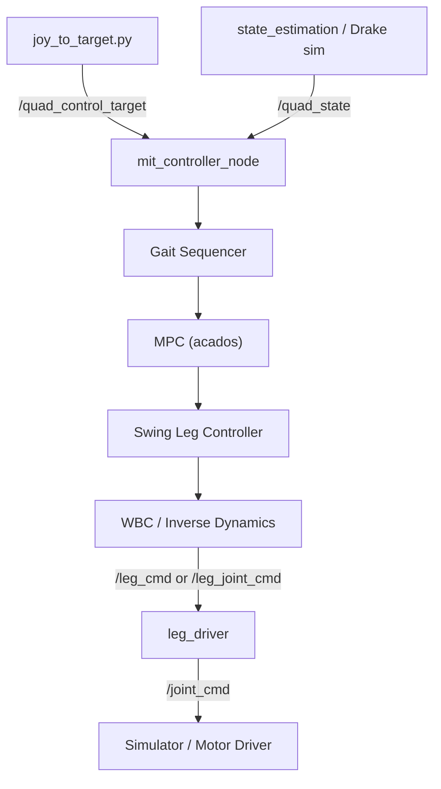

# `mit_controller_node.cpp` — Detailed Overview

This file is the **central ROS 2 node** of the quadruped locomotion stack. It orchestrates the full control pipeline: high-level velocity commands → gait planning → MPC ground-reaction forces → swing-leg trajectories → whole-body control → motor commands. It does **not** implement the algorithms themselves; it wires them together, runs them on separate timers, and handles synchronization, contact logic, and ROS I/O.

---

## Role in the Stack

The node sits in the middle of the architecture described in the repo rules:



On **simulation**, `/quad_state` comes from Drake (ground truth). On **real hardware**, it comes from the Invariant EKF in `state_estimation/`.

---

## Class Structure

The node is the `MITController` class (declared in `include/mit_controller_node.hpp`), a subclass of `rclcpp::Node`. It owns five major subsystems as polymorphic interfaces:

| Subsystem | Interface | Implementation(s) |
|-----------|-----------|-------------------|
| Gait planning | `GaitSequencerInterface` | `SimpleGaitSequencer`, `AdaptiveGaitSequencer`, `BioGaitSequencer` |
| Force optimization | `MPCInterface` | `MPC` (acados QP) |
| Swing trajectories | `SwingLegControllerInterface` | `SwingLegController` |
| Whole-body control | `WBCInterface<T>` | `WBCArcOPT` (Go2) or `InverseDynamics` (ULab) |
| Model adaptation | `ModelAdaptationInterface` | `KFModelAdaptation`, `LeastSquaresModelAdaptation` |

Shared state comes from:

- **`QuadState`** — estimated pose, twist, joints, foot contacts (`common/quad_state.hpp`)
- **`QuadModelPino`** — Pinocchio robot model: mass, inertia, kinematics (`common/quad_model_pino.hpp`)

---

## Timing and Threading

All rates are defined in `mit_controller_params.hpp`:

| Loop | Period | Rate | Callback |
|------|--------|------|----------|
| MPC | 10 ms | 100 Hz | `MPCLoopCallback` |
| Swing leg (SLC) | 2 ms | 500 Hz | `SLCLoopCallback` |
| Control / WBC | 2 ms | 500 Hz | `ControlLoopCallback` |
| Model adaptation | 10 ms | 100 Hz | `ModelAdaptationCallback` |
| Heartbeat | 500 ms | 2 Hz | `HartbeatCallback` |

Each loop runs in its own **mutually exclusive callback group**, and `main()` uses a **4-thread `MultiThreadedExecutor`**, so MPC, SLC, WBC, and model adaptation can run concurrently. Shared data is protected by mutexes (`quad_state_lock_`, `gs_wrench_sequence_lock_`, `targets_lock_`, etc.).

MPC uses a coarser internal discretization (`MPC_DT = 50 ms`, horizon = 10 steps = 500 ms lookahead). The gait sequence spans 100 steps at 50 ms each (5 seconds of contact/foot placement plan).

---

## Initialization Sequence (Constructor)

The constructor does a lot of work before the robot moves:

### 1. Parameter loading (~70 ROS parameters)

Covers MPC weights, friction (`mpc_mu`), force bounds, gait sequencer type, Raibert foot placement gain, contact detection flags, WBC gains, model adaptation, solver choice, etc. Config comes from YAML files like `config/mit_controller_sim_go2.yaml` plus `common/config/common_config_go2.yaml`, loaded by `launch/mit_controller.launch.py`.

### 2. Leg control mode selection

Four modes (`LEGControlMode` enum):

| Mode | Value | Output topic | WBC output type |
|------|-------|--------------|-----------------|
| `JOINT_CONTROL` | 0 | `/leg_joint_cmd` | joint pos/vel/torque |
| `JOINT_TORQUE_CONTROL` | 1 | `/leg_joint_cmd` | joint torque only |
| `CARTESIAN_STIFFNESS_CONTROL` | 2 | `/leg_cmd` | EE pos/vel/force + Kp/Kd |
| `CARTESIAN_JOINT_CONTROL` | 3 | `/leg_cmd` | EE pos/vel/force + Kp/Kd |

Per-mode PD gains are loaded separately for **stance** vs **swing** legs.

### 3. Target initialization

A `Target` struct (`target.hpp`) holds the desired body state. At startup, velocity/height/orientation targets are active; absolute x/y position is disabled (the robot stands in place):

```cpp
target_.active.hybrid_x_dot = true;
target_.active.hybrid_y_dot = true;
target_.active.wz = true;
target_.active.z = true;
// ...
target_.z = this->get_parameter("initial_height").as_double();
// ...
target_.active.x = false;
target_.active.y = false;
```

### 4. ROS publishers/subscribers

**Inputs:**

- `/quad_state` → `QuadStateUpdateCallback`
- `/quad_control_target` → `QuadControlTargetUpdateCallback` (joystick commands)

**Outputs (depending on mode):**

- `/leg_cmd` (Cartesian) or `/leg_joint_cmd` (joint-level)

**Diagnostics (compile-time flags in `mit_controller_params.hpp`):**

- `/gait_state`, `/gait_sequence`, `/solve_time`, `/wbc_solve_time`, `/wbc_target`, `/open_loop_trajectory`, `/controller_heartbeat`, `/quad_model_update`, `/quad_model_debug`

### 5. Wait for first state

The constructor **blocks** until the first `/quad_state` arrives, spinning the node briefly. Without state, MPC/WBC cannot initialize.

### 6. Subsystem construction

- **Gait sequencer** — selected by `gait_sequencer` param (`"Simple"` or `"Adaptive"`), with gait type (STAND, TROT, etc.) and Raibert foot step planner
- **MPC** — acados OCP solver; solver backend chosen by `mpc_solver` (HPIPM, OSQP, QPOASES, …)
- **Swing leg controller** — Bezier swing trajectories between footholds
- **WBC** — compile-time choice via `USE_WBC`:
  - **Go2**: `WBCArcOPT` (ARC-OPT TSID QP)
  - **ULab**: `InverseDynamics` (analytical ID + PD)

### 7. Leg driver handshake

Calls the `/switch_op_mode` service on `leg_driver` to set the matching control mode before starting loops.

### 8. Start MPC timer

Only the MPC timer starts initially. SLC and control timers are created **lazily** after the first successful MPC iteration.

---

## Runtime Loops

### `QuadStateUpdateCallback` — State ingestion

Copies incoming `QuadState` messages into `quad_state_` under a mutex. This is the only write path for robot state; all loops read a snapshot.

### `QuadControlTargetUpdateCallback` — High-level commands

Maps joystick messages (`QuadControlTarget.msg`: body velocities, height, yaw rate, roll/pitch) into the internal `Target` struct. Published by `scripts/joy_to_target.py` at ~20 Hz.

### `MPCLoopCallback` — 100 Hz: Gait + MPC

This is the slowest planning loop and drives everything else:

1. Snapshot `quad_state_`
2. Push state/target into gait sequencer, MPC, and SLC
3. Get `GaitSequence` from gait sequencer (contact schedule, foot placements, reference trajectory over 5 s)
4. Switch MPC state weights between **stand** (`KEEP`) and **move** (`MOVE`) modes
5. Solve MPC → get `WrenchSequence` (GRF per foot over horizon) and `MPCPrediction` (predicted CoM trajectory)
6. Publish diagnostics (solve time, gait state, open-loop trajectory)
7. On first run, start SLC (500 Hz) and control (500 Hz) timers

The gait sequencer produces a rich `GaitSequence` struct (`gait_sequence.hpp`): contact booleans, foot positions, reference CoM pose/velocity, swing times — all in world frame, indexed over 100 future steps.

### `SLCLoopCallback` — 500 Hz: Swing trajectories

Runs faster than MPC to smoothly interpolate swing foot motion:

1. When a new gait sequence arrives (`gs_updated_`), feed it to `SwingLegController`
2. Update with current state
3. Compute `FeetTargets` (position/velocity/acceleration per foot) along Bezier arcs
4. Track swing progress (0→1) and leg state (`STANCE`, `SWING`, `NOT_STARTED`)
5. Write results to shared `feet_targets_`, `feet_swing_progress_`, `feet_swing_states_`

Parameters: `slc_swing_height` (arc apex), `slc_world_blend` (world vs body frame blending), `maximum_swing_leg_progress_to_update_target`.

### `ControlLoopCallback` — 500 Hz: Contact logic + WBC + command output

The most complex loop. It merges MPC forces, SLC foot targets, and contact sensing into final motor commands.

**Step 1 — Gather snapshots:** wrench sequence, gait sequence, feet targets, swing progress, quad state.

**Step 2 — WBC target from MPC prediction:** Uses the MPC prediction at index `[1]` (one step ahead ≈ 50 ms) for CoM pose and velocity:

```cpp
wbc_->UpdateTarget(mpc_prediction_temp.orientation[1],
                   mpc_prediction_temp.position[1],
                   mpc_prediction_temp.linear_velocity[1],
                   mpc_prediction_temp.angular_velocity[1]);
```

**Step 3 — Per-leg contact state machine:** Each leg tracks one of five states:

| State | Meaning | Behavior |
|-------|---------|----------|
| `STANCE` | Planned + actual contact | Use gait foot target; apply MPC wrench |
| `SWING` | Planned flight | Zero MPC force; follow SLC trajectory |
| `EARLY_CONTACT` | Touchdown before scheduled | Hold foot position; transform future MPC wrench |
| `LATE_CONTACT` | Scheduled contact but no touch | Hold last body-relative position; zero force |
| `LOST_CONTACT` | Stance but foot slipped | Same as late contact |

Transitions depend on `early_contact_detection`, `late_contact_detection`, `lost_contact_detection` flags and actual contact sensors in `QuadState.foot_contact`.

**Step 4 — Assemble WBC inputs:** Modified contact flags, feet targets, and wrenches (swing legs get zero force).

**Step 5 — Set PD gains:** Stance vs swing Kp/Kd per leg based on contact flag.

**Step 6 — Solve WBC:** `GetJointCommand()` returns either Cartesian EE commands or joint torque/position/velocity.

**Step 7 — Publish** `/leg_cmd` or `/leg_joint_cmd` plus WBC diagnostics.

### `ModelAdaptationCallback` — 100 Hz: Online model update (IROS25 research)

When `use_model_adaptation: true`, estimates mass, CoM, and inertia online via Kalman filter or recursive least squares. On convergence, pushes updated `QuadModelPino` to MPC, gait sequencer, WBC, and SLC, and publishes `/quad_model_update`.

### `HartbeatCallback` — Health monitoring

Publishes `ControllerInfo` with counters for MPC/WBC failures, overtime, early contacts, model updates, and whether "keep pose" mode is active.

---

## Core Related Files

### Node and launch

| File | Purpose |
|------|---------|
| `include/mit_controller_node.hpp` | Class declaration, members, mutexes, callback signatures |
| `src/mit_controller_node.cpp` | **This file** — wiring, loops, contact logic |
| `launch/mit_controller.launch.py` | Safe-start check (3 s of stable state), loads config, starts joy + controller |
| `config/mit_controller_sim_go2.yaml` | Go2 sim parameters (MPC weights, WBC gains, gait, contact detection) |
| `config/mit_controller_sim_ulab.yaml` | ULab sim parameters |
| `config/mit_controller_real_*.yaml` | Real-robot variants |
| `include/mit_controller/mit_controller_params.hpp` | Timing constants, compile flags, robot-specific `USE_WBC` |
| `scripts/joy_to_target.py` | Joystick → `/quad_control_target` with acceleration limiting |

### Gait sequencing

| File | Purpose |
|------|---------|
| `include/mit_controller/gait_sequencer_interface.hpp` | Abstract gait sequencer API |
| `include/mit_controller/simple_gait_sequencer.hpp` + `.cpp` | Fixed-period gaits (STAND, TROT, BOUND, …) |
| `include/mit_controller/adaptive_gait_sequencer.hpp` + `.cpp` | Velocity-adaptive gait timing (Froude-based) |
| `include/mit_controller/bio_gait_sequencer.hpp` + `.cpp` | Bio-inspired gait variant |
| `include/mit_controller/gait.hpp` + `.cpp` | Gait definition: period, duty factor, phase offsets |
| `include/mit_controller/gait_sequence.hpp` | Core data structure passed to MPC/SLC/WBC |
| `include/mit_controller/raibert_foot_step_planner.hpp` + `.cpp` | Raibert heuristic foothold placement |
| `include/mit_controller/mpc_trajectory_planner.hpp` + `.cpp` | CoM reference trajectory generation |
| `include/mit_controller/target.hpp` | Internal high-level command representation |

### MPC

| File | Purpose |
|------|---------|
| `include/mit_controller/mpc_interface.hpp` | Abstract MPC API |
| `include/mit_controller/mpc.hpp` + `src/mit_controller/mpc.cpp` | 13-state centroidal MPC via acados (GRF optimization with friction pyramid) |
| `include/mit_controller/wrench_sequence.hpp` | Output: 3D forces per foot × horizon |
| `include/mit_controller/mpc_prediction.hpp` | Output: predicted CoM pose/velocity |
| `src/quad_linear_matrices.cpp` | Linearized dynamics matrices for MPC |

MPC state (13-D): roll, pitch, yaw, x, y, z, angular rates, linear velocities. Input (12-D): 3D GRF per foot. Constraints: friction cone (linearized), force bounds, contact-dependent zero force for swing legs.

### Swing leg control

| File | Purpose |
|------|---------|
| `include/mit_controller/swing_leg_controller_interface.hpp` | Abstract SLC API |
| `include/mit_controller/swing_leg_controller.hpp` + `.cpp` | Bezier swing trajectories |
| `include/SwingTrajectory.hpp` + `src/SwingTrajectory.cpp` | Foot swing Bezier curve math |
| `include/mit_controller/feet_targets.hpp` | Position/velocity/acceleration targets per foot |

### Whole-body control

| File | Purpose |
|------|---------|
| `include/mit_controller/wbc_interface.hpp` | Template WBC API |
| `include/mit_controller/wbc_arc_opt.hpp` + `src/mit_controller/wbc_arc_opt.cpp` | ARC-OPT TSID QP (Go2 default) |
| `include/mit_controller/inverse_dynamics.hpp` + `.cpp` | Analytical inverse dynamics (ULab default) |
| `include/mit_controller/joint_commands.hpp` | Command type structs (Cartesian, joint torque, etc.) |

WBC takes: MPC wrenches (stance), SLC foot targets (swing), MPC CoM reference, contact flags → outputs joint-level commands respecting dynamics and friction.

### Model adaptation (research)

| File | Purpose |
|------|---------|
| `include/model_adaptation/model_adaptation_interface.hpp` | Abstract API |
| `include/model_adaptation/kf_model_adaptation.hpp` + `.cpp` | Kalman filter adaptation |
| `include/model_adaptation/least_squares_model_adaptation.hpp` + `.cpp` | RLS adaptation |

### Shared infrastructure (`common/` package)

| File | Purpose |
|------|---------|
| `common/quad_state.hpp` | Robot state wrapper (pose, twist, joints, contacts) |
| `common/quad_model_pino.hpp` | Pinocchio model (FK, Jacobians, mass properties) |
| `common/model_interface.hpp`, `state_interface.hpp` | Abstract interfaces used by all subsystems |
| `common/eigen_msg_conversions.hpp` | ROS msg ↔ Eigen conversions |
| `common/custom_qos.hpp` | QoS profiles |

### ROS interfaces (`interfaces/` package)

| Message | Role |
|---------|------|
| `QuadControlTarget.msg` | High-level velocity/height/orientation commands |
| `QuadState.msg` | Full robot state (pose, twist, joints, contacts) |
| `LegCmd.msg` | Cartesian end-effector commands + Kp/Kd |
| `JointCmd.msg` | Joint position/velocity/torque + Kp/Kd |
| `GaitState.msg`, `GaitSequence.msg` | Gait diagnostics |
| `MPCDiagnostics.msg`, `WBCReturn.msg`, `WBCTarget.msg` | Solver diagnostics |
| `QuadModel.msg`, `QuadModelDebug.msg` | Model adaptation outputs |
| `ControllerInfo.msg` | Heartbeat / health counters |
| `ChangeLegDriverMode.srv` | Mode handshake with leg_driver |

### Downstream consumer

| File | Purpose |
|------|---------|
| `drivers/leg_driver.cpp` | Receives `/leg_cmd` or `/leg_joint_cmd`, runs IK, Jacobian, safety limits → `/joint_cmd` |
| `simulator/drake_simulator.cpp` or motor drivers | Execute `/joint_cmd`, publish `/joint_states`, `/imu_measurement`, `/contact_state` |
| `state_estimation/` | Invariant EKF on real hardware → `/quad_state` |

---

## Robot-Specific Behavior

From `mit_controller_params.hpp`:

```cpp
#ifdef ROBOT_MODEL
#if ROBOT_MODEL == GO2
static constexpr bool USE_WBC = true;
#elif ROBOT_MODEL == ULAB
static constexpr bool USE_WBC = false;
#endif
#endif
```

- **Go2** (`-DROBOT_NAME=go2`): Full ARC-OPT WBC QP, Cartesian or joint control, CycloneDDS
- **ULab** (`-DROBOT_NAME=ulab`): Inverse dynamics WBC, typically joint control, FastRTPS

Config YAMLs, URDF paths, shoulder positions, and gain tuning differ per robot.

---

## Parameter Hot-Reloading

The constructor registers an `on_set_parameters_callback` and a `ParameterEventHandler` that allows **runtime tuning** without restart for:

- MPC weights, friction, force bounds
- PD gains (all control modes)
- Contact detection flags
- Adaptive gait parameters
- SLC swing height
- WBC inverse dynamics options

Gait-related parameter changes trigger a full gait sequencer reload via `GetGaitSequencerFromParams()`.

---

## Safe Start (Launch Guard)

Before the controller starts, `mit_controller.launch.py` runs a **safe_start()** check: collects 3 seconds of `/quad_state`, verifies pose variance < 0.05 and mean velocity < 0.05. This ensures the robot is standing still after the stand-up sequence before locomotion control takes over. Disable with `safe_start:=false`.

---

## Summary

`mit_controller_node.cpp` is an **orchestrator**, not an algorithm library. Its responsibilities are:

1. **Wire** gait sequencer → MPC → swing leg controller → WBC into a closed loop
2. **Run** them on separate high-frequency timers with mutex-protected shared state
3. **Implement** the contact state machine that reconciles planned gait vs actual foot contacts
4. **Translate** between ROS messages and internal Eigen-based data structures
5. **Configure** everything from YAML, with runtime parameter tuning
6. **Publish** diagnostics and final motor commands to `leg_driver`

The actual math lives in the sibling files under `src/mit_controller/` (MPC, WBC, gait, swing), `src/model_adaptation/`, and the shared `common/` package.
